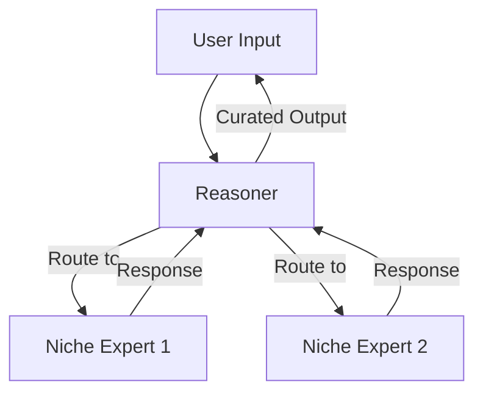

# Building DeepseekR: A Mixture-of-Experts Chat App for macOS

This tutorial walks through building **DeepseekR** from an empty Xcode project to a working
mixture-of-experts (MoE) chat application — the exact app in this repository. Along the way it
stops to explain the concepts that trip up developers who haven't met them before: Server-Sent
Events, `AsyncThrowingStream`, task groups, the App Sandbox, thinking mode, JSON output mode,
and more.

**What you'll build:**



A SwiftUI macOS chat app where a **Reasoner Core** reads each user request, decides which
specialized **experts** (DeepSeek instances with custom system prompts) should answer, consults
them *in parallel*, and synthesizes their answers into one streamed reply. When no configured
expert fits, the Reasoner writes a brand-new expert's system prompt on the fly.

**Prerequisites:** Xcode 16+, macOS 14.6+, a DeepSeek API key
([platform.deepseek.com/api_keys](https://platform.deepseek.com/api_keys)), and comfort with
basic Swift. Everything else is explained as we go.

---

## Table of Contents

1. [Project setup](#1-project-setup)
2. [Secrets without leaks: the .env file](#2-secrets-without-leaks-the-env-file)
3. [A testable networking layer](#3-a-testable-networking-layer)
4. [Talking to DeepSeek: the chat completions API](#4-talking-to-deepseek-the-chat-completions-api)
5. [Streaming with Server-Sent Events](#5-streaming-with-server-sent-events)
6. [The client: one protocol, two implementations](#6-the-client-one-protocol-two-implementations)
7. [Conversation state](#7-conversation-state)
8. [The expert pool](#8-the-expert-pool)
9. [The Reasoner Core: routing, consulting, synthesizing](#9-the-reasoner-core-routing-consulting-synthesizing)
10. [The UI](#10-the-ui)
11. [Testing without a network](#11-testing-without-a-network)
12. [Gotchas recap](#12-gotchas-recap)

---

## 1. Project setup

Create a new macOS App project in Xcode (SwiftUI interface, Swift language). Name it `DeepseekR`.

> **Concept — Synchronized folder groups (Xcode 16).** Older Xcode projects tracked every file
> in `project.pbxproj`; adding a file meant mutating that file (hello, merge conflicts). Xcode 16
> projects use `PBXFileSystemSynchronizedRootGroup`: the project references *folders*, and
> whatever is on disk inside them is automatically part of the target. Drop a `.swift` file into
> `DeepseekR/` and it compiles; drop a non-source file in and it ships as a *bundle resource*.
> We exploit that second behavior for secrets in the next section.

Keep the default targets: the app, a unit-test bundle (`DeepseekRTests`), and a UI-test bundle.

In **Signing & Capabilities**, leave **App Sandbox** enabled and check **Outgoing Connections
(Client)** — without it, every network request fails silently with a sandbox denial.

> **Concept — App Sandbox.** Mac apps distributed through the App Store (and well-behaved apps
> generally) run in a sandbox: a kernel-enforced container that blocks reading arbitrary files,
> arbitrary network use, etc., unless an *entitlement* grants it. Two consequences for this app:
> 1. We need `com.apple.security.network.client` to call the DeepSeek API.
> 2. The app **cannot read files from your repo checkout at runtime** — which shapes how we
>    load the API key below.

---

## 2. Secrets without leaks: the .env file

Never hardcode an API key in source. A public repo plus `private let apiKey = "sk-..."` equals a
leaked key — and keys live forever in git history even after you delete the line (scrubbing
requires rewriting history with a tool like `git filter-repo`, and the key must be rotated
regardless).

Our approach: a `.env` file that is **gitignored** but **copied into the app bundle at build
time**.

```bash
echo 'DEEPSEEK_API_KEY=sk-your-key-here' > DeepseekR/.env
```

And in `.gitignore`:

```gitignore
# Secrets - DeepSeek API key lives in DeepseekR/.env (see readme)
.env
```

Why put it *inside* the `DeepseekR/` source folder? Because of synchronized folder groups: Xcode
sees a non-source file in the folder and copies it into
`DeepseekR.app/Contents/Resources/.env` during the build. The sandboxed app can't read
`~/Development/.../DeepseekR/.env`, but it can always read its **own bundle resources**.

> ⚠️ The key is baked into the built `.app`. Fine for a local dev tool; don't distribute builds.

The loader ([`APIKeyProvider.swift`](DeepseekR/APIKeyProvider.swift)) reads the bundled file and
parses simple `KEY=VALUE` lines:

```swift
enum APIKeyProvider {
    private static let keyName = "DEEPSEEK_API_KEY"
    private static let placeholder = "sk-your-key-here"

    static func loadAPIKey() -> String? {
        guard let envURL = Bundle.main.resourceURL?.appendingPathComponent(".env"),
              let contents = try? String(contentsOf: envURL, encoding: .utf8) else {
            return nil
        }
        guard let value = parse(contents)[keyName], value != placeholder else {
            return nil
        }
        return value
    }

    /// Parses simple `KEY=VALUE` lines, ignoring blank lines and `#` comments.
    static func parse(_ contents: String) -> [String: String] {
        var values: [String: String] = [:]
        for line in contents.split(separator: "\n") {
            let trimmed = line.trimmingCharacters(in: .whitespaces)
            if trimmed.isEmpty || trimmed.hasPrefix("#") { continue }
            guard let separatorIndex = trimmed.firstIndex(of: "=") else { continue }
            let key = String(trimmed[..<separatorIndex]).trimmingCharacters(in: .whitespaces)
            var value = String(trimmed[trimmed.index(after: separatorIndex)...]).trimmingCharacters(in: .whitespaces)
            if value.count >= 2, value.hasPrefix("\""), value.hasSuffix("\"") {
                value = String(value.dropFirst().dropLast())
            }
            if !key.isEmpty, !value.isEmpty {
                values[key] = value
            }
        }
        return values
    }
}
```

Two details worth copying: the **placeholder check** (a fresh checkout's template value is
treated as "no key", producing a clear error instead of a confusing HTTP 401), and `parse` being
internal rather than private — so unit tests can hit it directly.

> **Concept — `enum` as a namespace.** `APIKeyProvider` is an enum with no cases. That's a
> common Swift idiom for a bag of static functions: unlike a struct, a case-less enum can never
> be instantiated, which documents that there's nothing to instantiate.

---

## 3. A testable networking layer

Before touching the AI API, build a thin, *mockable* HTTP layer
([`APIService.swift`](DeepseekR/APIService.swift)). The trick is one small protocol:

```swift
protocol NetworkLoadable {
    func data(using request: URLRequest) async throws -> (Data, HTTPURLResponse)
}

extension URLSession: NetworkLoadable {
    func data(using request: URLRequest) async throws -> (Data, HTTPURLResponse) {
        let (data, response) = try await self.data(for: request)
        guard let httpResponse = response as? HTTPURLResponse else {
            throw NetworkError.invalidResponse
        }
        return (data, httpResponse)
    }
}
```

> **Concept — protocol-based dependency injection.** `NetworkService` depends on
> `NetworkLoadable`, not `URLSession`. In production the default initializer hands it
> `URLSession.shared`; in tests you hand it a fake that returns canned data. No mocking
> framework, no network in tests. We use the same pattern again at a higher level with
> `DeepSeekChatting` in section 6 — inject at the *seam* you want to test around.

`NetworkService` itself wraps request building, JSON encode/decode, and the load call. The
detail most developers haven't used:

```swift
let encoder = JSONEncoder()
encoder.keyEncodingStrategy = .convertToSnakeCase   // responseFormat -> response_format
// ...
let decoder = JSONDecoder()
decoder.keyDecodingStrategy = .convertFromSnakeCase // reasoning_content -> reasoningContent
```

> **Concept — key encoding strategies.** Web APIs speak `snake_case`; Swift speaks `camelCase`.
> Rather than writing `CodingKeys` enums on every model, set a strategy on the encoder/decoder
> once and let it transform every key mechanically. The cost: it's all-or-nothing per
> encoder, so be consistent about which calls use it.

---

## 4. Talking to DeepSeek: the chat completions API

DeepSeek's API is OpenAI-shaped: you `POST` a JSON body to
`https://api.deepseek.com/chat/completions` with a `messages` array, and get back `choices`
containing an assistant message.

**A warning about model names:** AI APIs move fast and tutorials rot. As of mid-2026 the
current models are `deepseek-v4-flash` and `deepseek-v4-pro`; the old `deepseek-chat` /
`deepseek-reasoner` names are deprecated aliases scheduled for removal. *Always check the
[current docs](https://api-docs.deepseek.com/) instead of trusting a tutorial — including this
one.*

```swift
enum Model: String, Codable {
    case flash = "deepseek-v4-flash"
    case pro = "deepseek-v4-pro"
}

struct ChatMessage: Codable, Equatable {
    var content: String
    let role: MessageSourceType   // .system / .user / .assistant
    var name: String? = nil
}

struct ChatRequest: Encodable {
    let messages: [ChatMessage]
    let model: Model
    let stream: Bool
    var thinking: ThinkingConfig? = nil
    var responseFormat: ResponseFormat? = nil
}
```

Those last two fields are where the unfamiliar concepts live.

> **Concept — thinking mode and `reasoning_content`.** Reasoning models generate a private
> chain of thought before the answer. In DeepSeek v4 this is no longer a separate model — it's a
> per-request switch:
>
> ```json
> {"thinking": {"type": "enabled", "reasoning_effort": "high"}}
> ```
>
> The chain of thought comes back in a field called `reasoning_content`, *alongside* the normal
> `content`. Three rules:
> 1. **Thinking currently defaults to enabled** — if you want a fast, cheap, non-reasoning
>    call you must send `{"type": "disabled"}` explicitly.
> 2. **Never send `reasoning_content` back** in subsequent messages (outside of tool-call
>    flows). It's output, not conversation history. Our `ChatMessage` simply has no field for
>    it, so the mistake is unrepresentable.
> 3. Sampling knobs like `temperature` are silently ignored in thinking mode.

> **Concept — JSON output mode (structured output).** When you need the model's answer as
> machine-readable data (our router does), free-form text is fragile. Setting
> `"response_format": {"type": "json_object"}` makes the API *guarantee* syntactically valid
> JSON. Caveats: your prompt must literally mention json and show the schema you expect
> (otherwise the model can emit whitespace until it hits the token limit), valid JSON ≠ your
> schema (validate when decoding), and you should still set `max_tokens` sensibly to avoid
> truncation.

The matching Swift types:

```swift
struct ThinkingConfig: Encodable, Equatable {
    enum Mode: String, Encodable { case enabled, disabled }
    enum Effort: String, Encodable { case high, max }

    let type: Mode
    var reasoningEffort: Effort? = nil

    static let enabled = ThinkingConfig(type: .enabled)
    static let disabled = ThinkingConfig(type: .disabled)
}

struct ResponseFormat: Encodable, Equatable {
    let type: String
    static let jsonObject = ResponseFormat(type: "json_object")
}
```

And the response, decoded with `convertFromSnakeCase`:

```swift
struct ChatResponse: Decodable {
    let choices: [Choice]
    struct Choice: Decodable {
        let message: AssistantMessage
    }
}

/// `reasoningContent` is decode-only and must never be sent back as history.
struct AssistantMessage: Decodable {
    let role: MessageSourceType?
    let content: String?
    let reasoningContent: String?
}
```

---

## 5. Streaming with Server-Sent Events

Without streaming, the user stares at a spinner for the model's whole generation. With
`"stream": true`, the API holds the HTTP connection open and pushes tokens as they're produced.

> **Concept — Server-Sent Events (SSE).** SSE is a dead-simple, one-directional streaming
> protocol over plain HTTP (no WebSockets needed). The response body is a long-lived text
> stream of lines:
>
> ```
> data: {"choices":[{"delta":{"reasoning_content":"We"}}]}
>
> data: {"choices":[{"delta":{"content":"Hello"}}]}
>
> data: [DONE]
> ```
>
> Each event is a line starting with `data: `, events are separated by blank lines, and this
> API signals the end with the literal `[DONE]`. Each JSON chunk carries a `delta` — the *new
> tokens only*, not the accumulated text. In thinking mode, you'll receive
> `delta.reasoning_content` chunks first (the model thinking), then `delta.content` chunks
> (the answer). Your job: accumulate.

> **Concept — `URLSession.bytes(for:)` and `AsyncThrowingStream`.** Swift's structured way to
> consume SSE:
>
> - `URLSession.shared.bytes(for: request)` returns an `AsyncBytes` sequence, and its `.lines`
>   property gives you an `AsyncSequence` of `String` lines — backpressure and chunk-reassembly
>   handled for you.
> - `AsyncThrowingStream` is the bridge for *producing* an async sequence of your own: you get a
>   `continuation` object with `yield(_:)` (emit a value), `finish()` / `finish(throwing:)`
>   (end the sequence), and `onTermination` (a hook that fires if the *consumer* stops
>   iterating — where you cancel the underlying work so an abandoned stream doesn't keep a
>   network task alive).

Here's the heart of the client's streaming method ([`DeepSeekClient.swift`](DeepseekR/DeepSeekClient.swift)):

```swift
enum StreamEvent: Equatable {
    case reasoning(String)   // chain-of-thought delta
    case content(String)     // answer delta
}

func stream(messages: [ChatMessage], model: Model, thinking: ThinkingConfig? = nil)
    -> AsyncThrowingStream<StreamEvent, Swift.Error> {
    AsyncThrowingStream { continuation in
        let task = Task {
            do {
                let request = try self.makeRequest(messages: messages, model: model,
                                                   thinking: thinking, responseFormat: nil, stream: true)
                let (byteStream, response) = try await URLSession.shared.bytes(for: request)
                guard (response as? HTTPURLResponse)?.statusCode == 200 else {
                    continuation.finish(throwing: Error.invalidHTTPResponse)
                    return
                }

                let decoder = JSONDecoder()
                decoder.keyDecodingStrategy = .convertFromSnakeCase

                for try await line in byteStream.lines {
                    let trimmedLine = line.trimmingCharacters(in: .whitespacesAndNewlines)
                    if trimmedLine.isEmpty { continue }
                    if trimmedLine.lowercased().contains("keep-alive") { continue }

                    var jsonLine = trimmedLine
                    if jsonLine.hasPrefix("data:") {
                        jsonLine = String(jsonLine.dropFirst("data:".count)).trimmingCharacters(in: .whitespaces)
                    }
                    if jsonLine == "[DONE]" { break }
                    guard let data = jsonLine.data(using: .utf8) else { continue }

                    if let chunk = try? decoder.decode(StreamingChatResponse.self, from: data),
                       let delta = chunk.choices.first?.delta {
                        if let reasoning = delta.reasoningContent, !reasoning.isEmpty {
                            continuation.yield(.reasoning(reasoning))
                        }
                        if let content = delta.content, !content.isEmpty {
                            continuation.yield(.content(content))
                        }
                    }
                }
                continuation.finish()
            } catch {
                continuation.finish(throwing: error)
            }
        }
        continuation.onTermination = { _ in task.cancel() }
    }
}
```

Note the defensive bits learned from real traffic: skip blank lines, skip `keep-alive` comments,
strip the `data:` prefix *before* comparing against `[DONE]`, and treat an undecodable chunk as
skippable rather than fatal.

---

## 6. The client: one protocol, two implementations

Everything that talks to DeepSeek goes through one protocol:

```swift
protocol DeepSeekChatting {
    func complete(messages: [ChatMessage], model: Model,
                  thinking: ThinkingConfig?, responseFormat: ResponseFormat?) async throws -> AssistantReply

    func stream(messages: [ChatMessage], model: Model,
                thinking: ThinkingConfig?) -> AsyncThrowingStream<StreamEvent, Swift.Error>
}
```

`DeepSeekClient` is the production implementation — *stateless* (conversation history is the
caller's job), holding only the URL, the `NetworkService`, and the lazily-loaded API key:

```swift
private lazy var apiKey: String? = APIKeyProvider.loadAPIKey()
```

> **Concept — `lazy var`.** The bundle read happens once, on first use, not at init. Combined
> with a `guard let apiKey, !apiKey.isEmpty else { throw Error.missingAPIKey }` at request
> time, a missing key becomes a *thrown, user-visible error* at the moment of the first request
> instead of a crash at launch.

> **Concept — `LocalizedError`.** Swift errors shown to users via `error.localizedDescription`
> produce garbage ("The operation couldn't be completed…") unless you conform to
> `LocalizedError` and implement `errorDescription`. Ours returns actionable text:
> *"No DeepSeek API key found. Add DEEPSEEK_API_KEY to DeepseekR/.env and rebuild."*

The second implementation of `DeepSeekChatting` is the test fake (section 11). That's the whole
point of the protocol.

---

## 7. Conversation state

`APIHandler` is a small class that owns one conversation for "Single Expert" (direct) mode: an
`existingMessages: [ChatMessage]` array, a `createSystemMessage` guard (system messages must be
first), and send methods that append to history and delegate to the client.

One subtlety in the streaming path — the UI consumes deltas, but the *full* reply must join the
history afterwards or the next turn forgets this one:

```swift
func sendUserMessageStream(fromUser name: String? = nil, for model: Model = .flash,
                           content: String, thinking: ThinkingConfig = .disabled)
    -> AsyncThrowingStream<ChatMessage, Swift.Error> {
    existingMessages.append(ChatMessage(content: content, role: .user, name: name))
    let events = client.stream(messages: existingMessages, model: model, thinking: thinking)
    return AsyncThrowingStream { continuation in
        let task = Task {
            var fullReply = ""
            do {
                for try await event in events {
                    if case .content(let text) = event {
                        fullReply += text
                        continuation.yield(ChatMessage(content: text, role: .assistant))
                    }
                }
                if !fullReply.isEmpty {
                    self.existingMessages.append(ChatMessage(content: fullReply, role: .assistant))
                }
                continuation.finish()
            } catch {
                continuation.finish(throwing: error)
            }
        }
        continuation.onTermination = { _ in task.cancel() }
    }
}
```

> **Pitfall — one handler per conversation, not per message.** An early version of this app
> created `APIHandler()` inside the send button's closure. Every message got a *fresh, empty*
> history, so the model never remembered the previous turn — while the UI happily displayed a
> transcript that looked like a conversation. If your chatbot seems amnesiac but the screen
> looks right, check where your history object lives.

---

## 8. The expert pool

An expert is data, not code ([`Expert.swift`](DeepseekR/Expert.swift)):

```swift
struct Expert: Identifiable, Codable, Equatable, Hashable {
    var id = UUID()
    var name: String          // "Swift Engineer"
    var specialty: String     // one line the router reads to decide relevance
    var systemPrompt: String  // the expert's actual instructions
}
```

The separation of `specialty` from `systemPrompt` matters: the router's prompt includes only
names and specialties (cheap, focused), while the full system prompt is used only when that
expert is actually consulted.

`ExpertStore` persists the pool and seeds three defaults on first launch:

```swift
@MainActor
final class ExpertStore: ObservableObject {
    @Published private(set) var experts: [Expert]
    private let storageURL: URL

    init(storageURL: URL? = nil) {
        let url = storageURL ?? Self.defaultStorageURL
        self.storageURL = url
        if let data = try? Data(contentsOf: url),
           let saved = try? JSONDecoder().decode([Expert].self, from: data) {
            self.experts = saved
        } else {
            self.experts = Self.defaultExperts
            persist()
        }
    }
    // add / update / upsert / remove / restoreDefaults, each calling persist()
}
```

> **Concept — where files go in a sandboxed app.** `FileManager.default.urls(for:
> .applicationSupportDirectory, in: .userDomainMask)` does *not* return
> `~/Library/Application Support` for a sandboxed app — it returns the same path *inside the
> app's container* (`~/Library/Containers/com.infinitiq.DeepseekR/Data/Library/Application
> Support`). You don't need to care, and that's the point: use the API, never hardcode paths.
> Note the injectable `storageURL` — tests pass a temp directory and never touch real data.

> **Concept — `@MainActor` and `ObservableObject`.** `@Published` mutations drive SwiftUI
> updates, and UI updates must happen on the main thread. Annotating the whole class
> `@MainActor` makes the *compiler* enforce that every touch of `experts` happens on the main
> actor — instead of you remembering `DispatchQueue.main.async`. `@Published private(set)`
> completes the design: views can observe the array but can only change it through the store's
> methods, so persistence can never be skipped.

---

## 9. The Reasoner Core: routing, consulting, synthesizing

[`MoEOrchestrator.swift`](DeepseekR/MoEOrchestrator.swift) is the heart of the app. One public
method runs the whole pipeline and reports progress as a stream of events:

```swift
enum OrchestrationEvent: Equatable {
    case routingStarted
    case routed([ExpertAssignment])
    case expertReplied(ExpertReply)
    case synthesisStarted
    case synthesisReasoning(String)
    case synthesisDelta(String)
    case finished(String)
}

func respond(to query: String, roster: [Expert]) -> AsyncThrowingStream<OrchestrationEvent, Swift.Error>
```

> **Concept — events as an API.** The orchestrator could expose `async throws -> String` and
> return only the final answer — but then the UI couldn't show "Consulting Swift Engineer…" or
> stream the synthesis. Emitting a typed event enum through an `AsyncThrowingStream` gives the
> UI a complete, ordered narration of a multi-stage process while keeping the orchestrator
> UI-agnostic. The same pattern fits any long pipeline (imports, builds, syncs).

### Stage 1 — Routing (structured output in anger)

The router is a `deepseek-v4-flash` call with **thinking disabled** (latency matters; this is a
classification task) and **JSON output mode on**. The system prompt states the schema exactly
and the rules: prefer roster experts; only invent a `new_experts` entry when nobody fits; 1–3
experts; one focused question each.

The reply decodes into:

```swift
struct RoutingDecision: Decodable, Equatable {
    struct Assignment: Decodable, Equatable { let name: String; let question: String }
    struct NewExpert: Decodable, Equatable {
        let name: String; let specialty: String; let systemPrompt: String; let question: String
    }
    var experts: [Assignment]?
    var newExperts: [NewExpert]?
}
```

…with defensive parsing: strip a markdown code fence if the model wrapped its JSON anyway, map
names back to roster `Expert`s **case-insensitively**, *drop* hallucinated names that match no
roster expert, dedupe, and cap the total at `maxExpertsPerTurn`.

> **Concept — never trust model output, even "guaranteed" output.** JSON mode guarantees
> syntax, not semantics. The model can still name an expert that doesn't exist, return seven
> experts when you asked for three, or omit a field. Every one of those cases gets an explicit,
> tested handling path. Treat model output like user input: validate at the boundary.

The `new_experts` array is the **dynamic composition** feature: the Reasoner literally writes a
new expert's system prompt when the roster has no fit. Those experts exist only for the turn
(they're not persisted) — promoting good ones to the saved roster would be a natural extension.

### Stage 2 — Parallel consultation

Each chosen expert gets a fresh two-message conversation — its own system prompt, plus the
original query and its focused question. Experts know nothing about each other.

```swift
private func consult(assignments: [ExpertAssignment], query: String,
                     onReply: (ExpertReply) -> Void) async throws -> [ExpertReply] {
    guard !assignments.isEmpty else { return [] }
    var replies: [ExpertReply] = []
    try await withThrowingTaskGroup(of: ExpertReply?.self) { group in
        for assignment in assignments {
            group.addTask {
                do {
                    let reply = try await self.client.complete(
                        messages: [
                            ChatMessage(content: assignment.expert.systemPrompt, role: .system),
                            ChatMessage(content: "Original user request: \(query)\n\nYour question to answer: \(assignment.question)",
                                        role: .user)
                        ],
                        model: .flash, thinking: .disabled, responseFormat: nil
                    )
                    return ExpertReply(assignment: assignment, answer: reply.content)
                } catch is CancellationError {
                    throw CancellationError()
                } catch {
                    // One unavailable expert shouldn't sink the turn.
                    return nil
                }
            }
        }
        for try await reply in group {
            if let reply { replies.append(reply); onReply(reply) }
        }
    }
    return replies
}
```

> **Concept — structured concurrency and task groups.** `withThrowingTaskGroup` runs the child
> tasks concurrently and *scopes* them: the group cannot outlive the function, and cancelling
> the parent cancels every child automatically (this is what makes the stream's
> `onTermination → task.cancel()` actually stop in-flight expert calls). The non-obvious gem:
> `for try await reply in group` yields results in **completion order**, not submission order —
> so the UI can check off each expert the moment it answers, while slower ones are still
> working.

> **Concept — partial failure isolation.** Each child catches its own errors and returns `nil`
> instead of throwing (except `CancellationError`, which must propagate or cancellation breaks).
> A `nil` means "this expert didn't answer"; the Reasoner synthesizes from whoever did. Decide
> deliberately, per stage, whether an error should sink the whole operation — here, routing
> failures are fatal but a single expert failure is not.

### Stage 3 — Synthesis (thinking mode in anger)

The synthesizer gets a system prompt ("resolve disagreements, drop redundancy, answer the user
directly, don't mention the experts"), the **conversation history of prior turns**, and a user
message packing the query plus each expert's labeled answer. It runs with **thinking enabled**
and streams:

```swift
var finalAnswer = ""
for try await event in client.stream(messages: messages, model: .flash, thinking: .enabled) {
    switch event {
    case .reasoning(let text): onReasoning(text)             // surfaced as a status line
    case .content(let text):   finalAnswer += text; onDelta(text)
    }
}
return finalAnswer
```

After synthesis, only the user query and the final answer join `conversation` — expert
intermediate output and reasoning never re-enter context. Routing additionally receives a
*compact* transcript (last 4 turns, 300 chars each) so follow-up questions route correctly
without resending everything.

> **Concept — context-window budgeting.** Every token you resend costs money and attention.
> The pattern here — full history only where it's needed (synthesis), truncated summaries where
> a hint suffices (routing), and intermediate artifacts dropped entirely — is the basic
> discipline of building on LLM APIs.

---

## 10. The UI

[`ContentView.swift`](DeepseekR/ContentView.swift) adds a mode picker (Single Expert / Expert
Team), a transcript, a live progress panel, and an input field. The interesting part is how the
team turn consumes orchestration events:

```swift
private func sendTeam(_ query: String) {
    statusText = "Reasoner is routing…"
    Task {
        do {
            for try await event in orchestrator.respond(to: query, roster: expertStore.experts) {
                handle(event)   // updates @State: status line, expert checkmarks, streaming text
            }
        } catch {
            presentError(error)
        }
        finishTurn()
    }
}
```

> **Concept — `Task {}` inherits the actor.** A `Task` created inside a SwiftUI view method
> inherits the main actor, so every `@State` mutation inside the `for await` loop is already on
> the main thread — no `DispatchQueue.main.async`, no data races. (A `Task.detached` would
> *not* inherit it; that's the difference between the two.)

> **Concept — `@StateObject` vs `@State` with a class.** `ExpertStore` is `@StateObject`: it
> publishes changes the view must re-render for. `APIHandler` and `MoEOrchestrator` are plain
> `@State` references: the view never *observes* them, it just needs them to survive view
> re-creation — and unlike `@StateObject`, a `@State` reference can be *reassigned*, which is
> exactly how "New Chat" works: `apiHandler = APIHandler(); orchestrator = MoEOrchestrator()`.

Each finished team reply stores its `[ExpertReply]` in a dictionary keyed by message ID, and the
transcript renders a collapsible `DisclosureGroup` ("Expert breakdown") under the answer showing
who was consulted, what each was asked, and their raw answers — with dynamically-assembled
experts labeled. [`ExpertManagementView.swift`](DeepseekR/ExpertManagementView.swift) is a
straightforward CRUD sheet over `ExpertStore` using `.sheet(item:)` for the editor.

---

## 11. Testing without a network

Because the orchestrator depends on `DeepSeekChatting`, the whole MoE pipeline tests offline
with a fake ([`DeepseekRTests.swift`](DeepseekRTests/DeepseekRTests.swift)):

```swift
final class FakeDeepSeekClient: DeepSeekChatting, @unchecked Sendable {
    private let lock = NSLock()
    var routingJSON = "{\"experts\": [], \"new_experts\": []}"
    var answersBySystemPrompt: [String: String] = [:]
    var streamEvents: [StreamEvent] = []

    func complete(messages: [ChatMessage], model: Model,
                  thinking: ThinkingConfig?, responseFormat: ResponseFormat?) async throws -> AssistantReply {
        lock.withLock { completeCallCount += 1 }
        if responseFormat == .jsonObject {                       // routing call
            return AssistantReply(content: routingJSON, reasoningContent: nil)
        }
        let systemPrompt = messages.first(where: { $0.role == .system })?.content ?? ""
        let answer = answersBySystemPrompt.first(where: { systemPrompt.contains($0.key) })?.value ?? "generic answer"
        return AssistantReply(content: answer, reasoningContent: nil)
    }
    // stream(...) replays streamEvents through an AsyncThrowingStream
}
```

Design notes the average test suite gets wrong:

- **The fake dispatches on *what kind* of call it receives** (JSON format ⇒ routing; otherwise
  match the system prompt), because the task group calls it concurrently and completion order
  is nondeterministic. Assertions compare `Set`s of answers, not arrays.
- **`@unchecked Sendable` + `NSLock.withLock`**: the fake is mutated from concurrent child
  tasks; the lock makes that safe, and `withLock` (rather than `lock()`/`unlock()`) keeps
  Swift 6's "no lock across await" diagnostics quiet.
- **Async tests are just `func testX() async throws`** — XCTest awaits them natively; no
  expectations dance.

The suite covers: `.env` parsing, request encoding (thinking/response_format present when set,
absent when nil), `reasoning_content` decoding, routing-JSON parsing including the fenced and
garbage cases, the full orchestration event sequence, the no-experts fallback, hallucinated
names + the per-turn cap, streaming history append, and `ExpertStore` persistence round-trips
in a temp directory.

One environment gotcha: unit tests for an app target run *inside the app* (`TEST_HOST`), so
macOS must actually launch the GUI app. If `xcodebuild test` reports *"the test runner hung
before establishing connection"*, something is blocking app launch — an unsigned sandboxed
binary, a headless session, or an over-restrictive shell sandbox.

---

## 12. Gotchas recap

| Gotcha | Fix |
|---|---|
| API key in source on a public repo | `.env` (gitignored) bundled via synchronized folder groups; **rotate** any leaked key — deleting the line doesn't delete git history |
| Sandboxed app can't read repo files | Read from `Bundle.main.resourceURL`, not source paths |
| Thinking mode is on by default | Send `thinking: {"type": "disabled"}` explicitly for fast calls |
| Sending `reasoning_content` back as history | Don't — keep it out of your request message type entirely |
| JSON mode without "json" in the prompt | Model may emit whitespace forever; always show the schema in the prompt |
| Trusting routing output | Validate: case-insensitive name match, drop unknowns, dedupe, cap |
| `data: [DONE]` parsed as JSON | Strip the `data:` prefix first, then compare |
| Fresh handler per message | One conversation object per conversation; symptom is an amnesiac bot with a normal-looking transcript |
| Whole turn fails when one expert fails | Per-child `catch` returning `nil`; always re-throw `CancellationError` |
| Abandoned stream keeps network task alive | `continuation.onTermination = { _ in task.cancel() }` |
| UI mutations from background tasks | `@MainActor` types and actor-inheriting `Task {}` |
| Deprecated model names | Check current docs; model names rot faster than tutorials |

---

*Total: ~1,550 lines of Swift across eight files, no third-party dependencies. The complete
source is this repository — compare any section against the real files as you build.*
