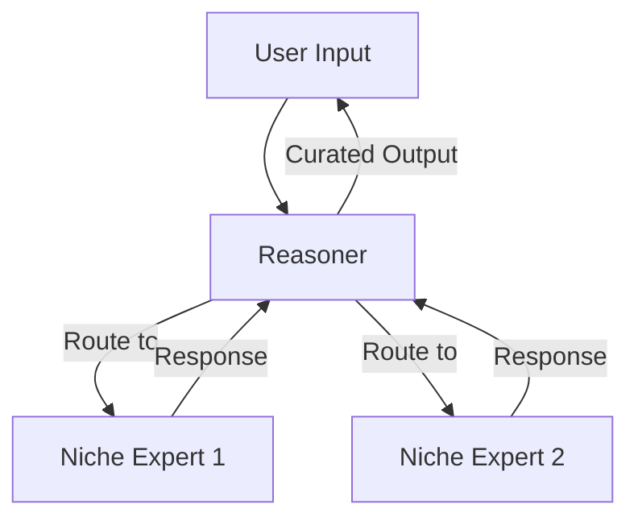

# DeepseekR (Deepseeker) 🤖💬

**Experimental MoE-Powered Chat Interface for macOS, written in Swift**
*Harnessing Mixture-of-Experts Architecture Through Conversational AI*

[](https://github.com/InfinitIQ-Tech/DeepseekR)
[](https://github.com/InfinitIQ-Tech/DeepseekR/blob/main/license.md)


*Basic chat interface - placeholder for actual screenshot*

## Why DeepseekR? 🧠

**Pushing MoE (Mixture-of-Experts) Architecture to New Frontiers**  
While Deepseek already utilizes MoE internally, DeepseekR enables:

🔧 **Developer-Controlled Expert Orchestration**  
   Create and manage specialized AI assistants with custom system messages

🤝 **Dynamic Expert Collaboration**
   Let a reasoner agent moderate conversations between multiple experts

🌱 **Lightweight Foundation**  
   Simple Swift implementation focused on extensibility using baked-in libraries rather than complexity

## Current Alpha Features (2 Hours In! ⏳)

- ✅ Basic chat completions interface
- ✅ System message configuration
- ✅ Deepseek-chat integration
- ❌ Deepseek-reasoner implementation (coming soon)
- ❌ Streaming (coming soon)
- ❌ Expert moderation (coming soon)
- ❌ Function calling (planned)

## Developer Roadmap 🗺️

### Immediate Goals
- [ ] Chat with deepseek-reasoner implementation  
- [ ] Basic streaming support  
- [ ] Modular expert configuration  

### MoE Vision

*Planned Expert Orchestration Flow*  
- **Expert Pool**: Multiple Deepseek instances with specialized system prompts  
- **Reasoner Core**: AI moderator handling expert selection and response synthesis  
- **Dynamic Composition**: Automatic expert team assembly based on conversation needs  

## Installation (Early Alpha)
```bash
# Clone repository
git clone https://github.com/InfinitIQ-Tech/DeepseekR.git

# Open in Xcode 15+
open DeepseekR.xcodeproj

# Build & Run (Requires macOS 14+)
```

⚠️ **Note:** Currently requires manual API key configuration in `APIService.swift`. Apply for your API key at [https://platform.deepseek.com/api_keys](https://platform.deepseek.com/api_keys)

## Contributing Opportunities 🤝

### 🧩 MoE Architecture
- Expert routing algorithms  
- Response synthesis strategies  
- Load balancing between experts  

### 🚢 Core Infrastructure
- macOS native UI improvements
- Secure credential storage

### 🧪 Research Directions
- Expert specialization metrics  
- Collaborative prompting techniques  
- Failure recovery mechanisms  

## Disclaimer ⚠️
This is an **EXTREMELY EARLY** experimental project (literally 2 hours old!). Expect:  
- 🔨 Breaking API changes (it's currently not a framework, just an app)
- 🔥 Missing error handling
- 📦 Basic UI implementation

**Not production-ready** - Ideal for MoE researchers and Swift AI enthusiasts wanting to shape foundational architecture.

We believe *The expert of tomorrow will be the system that best coordinates specialized knowledge* - Let's build that future together!
