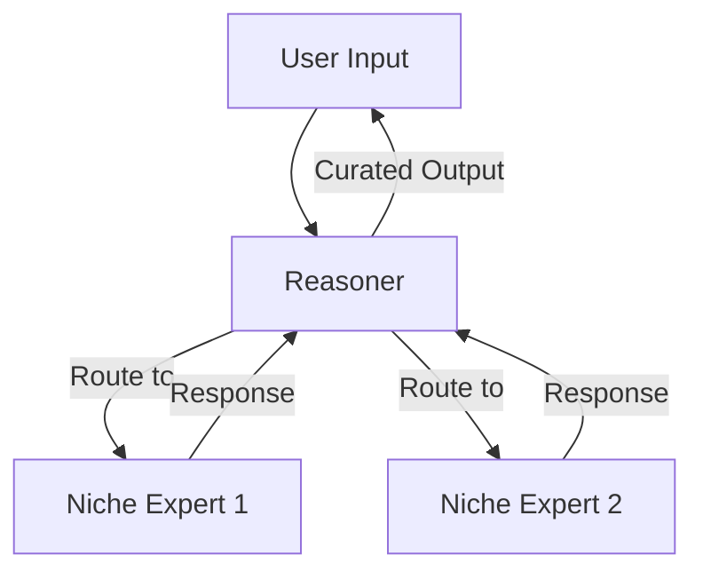

# DeepseekR (Deepseeker) 🤖💬

**Experimental MoE-Powered Chat Interface for macOS, written in Swift**
*Harnessing Mixture-of-Experts Architecture Through Conversational AI*

[](https://github.com/InfinitIQ-Tech/DeepseekR)
[](https://github.com/InfinitIQ-Tech/DeepseekR/blob/main/license.md)

## Why DeepseekR? 

🧠 **Pushing MoE (Mixture-of-Experts) Architecture to New Frontiers**  
While Deepseek already utilizes MoE internally, DeepseekR enables:

🔧 **Developer-Controlled Expert Orchestration**  
Create and manage specialized AI assistants with custom system messages

🤝 **Dynamic Expert Collaboration**  
Let a reasoner agent moderate conversations between multiple experts

🌱 **Lightweight Foundation**  
   Simple Swift implementation focused on extensibility using baked-in libraries rather than complexity

## Current Alpha Features

✅ Basic chat completions interface  
✅ System message configuration  
✅ deepseek-v4-flash integration (thinking and non-thinking modes)  
✅ Streaming (including chain-of-thought `reasoning_content`)  
✅ Expert moderation — the Reasoner Core routes, consults experts in parallel, and synthesizes  
✅ Modular expert configuration (create/edit/delete experts in-app, persisted between launches)  
✅ Dynamic expert composition — the Reasoner assembles new experts when the roster has no fit  
❌ Function calling (planned)  

## Developer Roadmap 🗺️

### Immediate Goals
- [x] Chat with reasoning (thinking mode) implementation  
- [x] Basic streaming support  
- [x] Modular expert configuration  
- [ ] Function calling  
- [ ] Conversation persistence  

### MoE Vision — Implemented ✅

```mermaid
graph TD
    User[User Input] --> Reasoner
    Reasoner -->|Route to| Expert1[Niche Expert 1]
    Reasoner -->|Route to| Expert2[Niche Expert 2]
    Expert1 -->|Response| Reasoner
    Expert2 -->|Response| Reasoner
    Reasoner -->|Curated Output| User
```
*Expert Orchestration Flow*  
- **Expert Pool**: Multiple Deepseek instances with specialized system prompts — manage them via the **Experts…** button (`Expert.swift`, `ExpertManagementView.swift`)  
- **Reasoner Core**: AI moderator handling expert selection and response synthesis (`MoEOrchestrator.swift` — routing uses guaranteed-JSON output, synthesis streams in thinking mode)  
- **Dynamic Composition**: Automatic expert team assembly based on conversation needs — when no roster expert fits, the Reasoner writes a new expert's system prompt on the fly  

### Using Expert Team mode
1. Build & run, pick **Expert Team** in the mode picker (or **Single Expert** for classic direct chat).  
2. Ask anything — the status line shows routing, each expert checking in, and the synthesized reply streaming.  
3. Expand **Expert breakdown** under a reply to see who was consulted, what each was asked, and their raw answers.  

## Build It Yourself 📘

Want to understand every piece? [TUTORIAL.md](TUTORIAL.md) walks through building this exact app
from scratch — including the concepts most developers haven't met yet (Server-Sent Events,
`AsyncThrowingStream`, task groups, the App Sandbox, thinking mode, JSON output mode).

## Installation (Early Alpha)
```bash
# Clone repository
git clone https://github.com/InfinitIQ-Tech/DeepseekR.git

# Open in Xcode 16+
open DeepseekR.xcodeproj

# Build & Run (Requires macOS 14.6+)
```

### API Key Setup

Apply for your API key at [https://platform.deepseek.com/api_keys](https://platform.deepseek.com/api_keys), then create a `.env` file in the `DeepseekR/` source folder:

```bash
echo 'DEEPSEEK_API_KEY=sk-your-key-here' > DeepseekR/.env
```

The `.env` file is gitignored, so your key never enters source control. Xcode copies it into the app bundle at build time, where the sandboxed app reads it on launch.

⚠️ Because the key is baked into the built app, don't distribute your `.app` bundle.

## Contributing Opportunities 🤝

### 🧩 MoE Architecture
- Expert routing algorithms  
- Response synthesis strategies  
- Load balancing between experts  

### 🚢 Core Infrastructure
- macOS native UI improvements
- Keychain-based credential storage
- Conversation persistence across launches

### 🧪 Research Directions
- Expert specialization metrics  
- Collaborative prompting techniques  
- Failure recovery mechanisms  

## Disclaimer ⚠️
This is an **EARLY** experimental project. Expect:  
- 🔨 Breaking API changes (it's currently not a framework, just an app)
- 🔥 Missing error handling
- 📦 Basic UI implementation

**Not production-ready** - Ideal for MoE researchers and Swift AI enthusiasts wanting to shape foundational architecture.

We believe *The expert of tomorrow will be the system that best coordinates specialized knowledge* - Let's build that future together!
